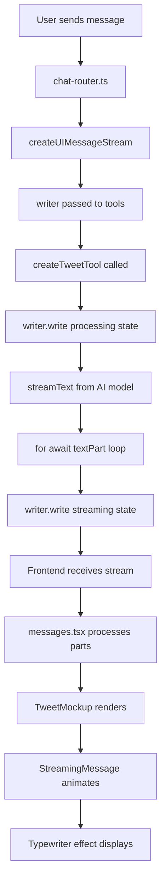

I'll explain how the [TweetMockup](file:///Users/nirmal/Desktop/contentport/src/components/chat/tweet-mockup.tsx#L9-L157) component works, its dependencies, and help you understand what you need to use it in a different project.

```toolCall::read_file
```

Now let me examine the dependencies to understand what's needed:

```toolCall::read_file
```


```toolCall::read_file
```


```toolCall::read_file
```

## TweetMockup Component Explanation

The **TweetMockup** component is a sophisticated React component that creates a Twitter/X-like interface with smooth animations and interactive features. Here's a comprehensive breakdown:

## 🎯 Core Functionality

### 1. **Visual Structure**
- **Grid Layout**: Uses CSS Grid with `grid-cols-[40px,1fr]` for avatar and content columns
- **Twitter-like Styling**: Replicates Twitter's visual design with shadows, borders, and spacing
- **Thread Support**: Can display connected tweets in a thread format

### 2. **Animation Features (Framer Motion)**
```typescript
const containerVariants = {
  hidden: { opacity: 0, y: 20, scale: 0.95 },
  visible: {
    opacity: 1, y: 0, scale: 1,
    transition: {
      type: 'spring', duration: 0.6, bounce: 0.1,
      staggerChildren: 0.1, delayChildren: 0.2,
    },
  },
}
```

### 3. **State Management**
- **Loading State**: Shows skeleton loaders when `isLoading={true}`
- **Thread Connection**: Visual indicators for connected tweets
- **Interactive Apply**: Button to transfer content to tweet editor

## 📦 Dependencies Required

### **Core Dependencies**
```json
{
  "framer-motion": "^11.x.x",
  "react": "^18.x.x || ^19.x.x",
  "lucide-react": "^0.x.x",
  "clsx": "^2.x.x",
  "tailwind-merge": "^2.x.x"
}
```

### **Optional/Lexical Dependencies (for Apply function)**
```json
{
  "lexical": "^0.x.x"
}
```

## 🔧 How to Use in Different Project

Here's a simplified, standalone version you can use:

```toolCall::create_file
```

## 🚀 Usage Examples

Here are different ways to use the TweetMockup component:

### **1. Basic Usage**
```tsx
<TweetMockup 
  index={0}
  account={{
    name: 'John Doe',
    username: 'johndoe',
    verified: true,
    avatar: 'https://example.com/avatar.jpg'
  }}
  onApply={(text, threads, index) => {
    console.log('Content applied:', text)
  }}
>
  <div>Your tweet content here!</div>
</TweetMockup>
```

### **2. Loading State**
```tsx
<TweetMockup 
  index={0}
  isLoading={true}
/>
```

### **3. Thread Display**
```tsx
{threads.map((thread, i) => (
  <TweetMockup
    key={i}
    index={i}
    isConnectedBefore={i > 0}
    isConnectedAfter={i < threads.length - 1}
    threads={threads}
  >
    {thread}
  </TweetMockup>
))}
```

## 🎨 Key Framer Motion Features

### **1. Container Animation**
- **Spring transition** with bounce effect
- **Staggered children** animation
- **Scale and opacity** changes

### **2. Loading Skeleton**
- **Sequential appearance** of skeleton bars
- **Different widths** for realistic loading
- **Smooth opacity transitions**

### **3. Apply Button**
- **Fade-in animation** when content is ready
- **Micro-interactions** on hover/click

## 🔧 Customization Options

### **Styling**
- Use [className](file:///Users/nirmal/Desktop/contentport/src/components/ui/duolingo-button.tsx#L16-L16) prop for custom styles
- Modify Tailwind classes for different themes
- Adjust shadow and border styles

### **Account Data**
- Pass any user information via [account](file:///Users/nirmal/Desktop/contentport/src/db/schema/auth.ts#L33-L50) prop
- Support for verified badges
- Customizable avatar fallbacks

### **Callbacks**
- [onApply](file:///Users/nirmal/Desktop/contentport/standalone-tweet-mockup.tsx#L89-L89) function for handling content application
- Pass [text](file:///Users/nirmal/Desktop/contentport/standalone-tweet-mockup.tsx#L76-L76), [threads](file:///Users/nirmal/Desktop/contentport/standalone-tweet-mockup.tsx#L77-L77), and [index](file:///Users/nirmal/Desktop/contentport/standalone-tweet-mockup.tsx#L80-L80) data

## 🛠️ Installation Steps for New Project

1. **Install dependencies:**
```bash
npm install framer-motion lucide-react clsx tailwind-merge
```

2. **Set up Tailwind CSS** (if not already installed)

3. **Copy the standalone component** I created above

4. **Use it in your project:**
```tsx
import { TweetMockup } from './standalone-tweet-mockup'

function MyComponent() {
  return (
    <TweetMockup 
      index={0}
      account={{ name: 'Your Name', username: 'yourusername' }}
      onApply={(text) => console.log('Applied:', text)}
    >
      Your content here!
    </TweetMockup>
  )
}
```

The standalone version I created removes all the project-specific dependencies and provides a clean, reusable component that you can easily integrate into any React project! 🎉

I'll explain how streaming works through the writer and tool calls, pointing you to the specific files and code sections.

## 🔄 Streaming Flow Overview

The streaming system uses AI SDK's tool system with a custom writer to stream content in real-time. Here's the complete flow:

## 1. **Stream Initiation (chat-router.ts)**

```toolCall::read_file
```

### **Key Points in chat-router.ts:**

1. **Stream Creation** (lines 230-240):
```typescript
const stream = createUIMessageStream<MyUIMessage>({
  originalMessages: messages,
  generateId: createIdGenerator({ prefix: 'msg', size: 16 }),
  // ... callbacks
  execute: async ({ writer }) => {
    // This is where streaming happens
  }
})
```

2. **Tool Setup** (lines 280-290):
```typescript
const writeTweet = createTweetTool({
  writer, // ← The writer is passed to the tool
  ctx: { /* context data */ }
})
```

3. **AI Model Streaming** (lines 295-310):
```typescript
const result = streamText({
  model: openrouter.chat('openai/gpt-4.1'),
  tools: { writeTweet, readWebsiteContent }, // ← Tools that can stream
  experimental_transform: smoothStream({ delayInMs: 20 })
})

writer.merge(result.toUIMessageStream()) // ← Stream is merged with writer
```

## 2. **Tool Implementation (create-tweet-tool.ts)**

```toolCall::read_file
```

### **Key Streaming Points in create-tweet-tool.ts:**

1. **Initial Processing Signal** (lines 97-105):
```typescript
writer.write({
  type: 'data-tool-output',
  id: generationId,
  data: {
    text: '',
    index,
    status: 'processing', // ← Shows loading state
  },
})
```

2. **Stream Processing Loop** (lines 225-240):
```typescript
let fullText = ''

for await (const textPart of result.textStream) {
  fullText += textPart // ← Accumulate text chunks
  writer.write({
    type: 'data-tool-output',
    id: generationId,
    data: {
      text: fullText, // ← Send accumulated text
      index,
      status: 'streaming', // ← Indicates streaming state
    },
  })
}
```

3. **Completion Signal** (lines 241-250):
```typescript
writer.write({
  type: 'data-tool-output',
  id: generationId,
  data: {
    text: fullText,
    index,
    status: 'complete', // ← Signals streaming is done
  },
})
```

## 3. **Frontend Message Processing (messages.tsx)**

```toolCall::read_file
```

### **Key Points in messages.tsx:**

1. **Processing State Detection** (lines 121-123):
```typescript
if (part.type === 'data-tool-output') {
  if (part.data.status === 'processing') {
    return <TweetMockup key={i} isLoading index={part.data.index} />
  }
  // ... streaming content
}
```

2. **Streaming Content Rendering** (lines 125-155):
```typescript
const threads = part.data.text.split('---')

return (
  <div>
    {threads.map((thread, i) => (
      <TweetMockup
        isConnectedAfter={threads.length > 1 && i < threads.length - 1}
        isConnectedBefore={i > 0}
        threads={threads}
        text={thread.trim()}
        index={i}
      >
        <StreamingMessage animate={true} text={thread.trim()} />
      </TweetMockup>
    ))}
  </div>
)
```

## 4. **Streaming Animation (streaming-message.tsx)**

```toolCall::read_file
```

### **Key Points in streaming-message.tsx:**

1. **Delta Detection** (lines 76-85):
```typescript
useEffect(() => {
  if (!text || !animate) return

  if (contentRef.current !== text) {
    const delta = text.slice(contentRef.current.length) // ← New content only
    if (delta) {
      addPart(delta) // ← Add new part to animation queue
    }
    contentRef.current = text
  }
}, [text, animate, addPart])
```

2. **Typewriter Animation** (lines 30-55):
```typescript
const animate = (time: number) => {
  if (streamIndexRef.current < fullText.length) {
    if (time - lastTimeRef.current > typewriterSpeed) {
      streamIndexRef.current++
      setStream(fullText.slice(0, streamIndexRef.current)) // ← Character by character
      lastTimeRef.current = time
    }
    frame.current = requestAnimationFrame(animate)
  }
}
```

## 🔄 **Complete Streaming Flow**



## 📁 **Key Files Summary**

| File | Purpose | Key Functions |
|------|---------|---------------|
| **[chat-router.ts](/Users/nirmal/Desktop/contentport/src/server/routers/chat/chat-router.ts)** | Stream orchestration | `createUIMessageStream`, `writer.merge()` |
| **[create-tweet-tool.ts](/Users/nirmal/Desktop/contentport/src/server/routers/chat/tools/create-tweet-tool.ts)** | Tool implementation | `writer.write()`, streaming loop |
| **[messages.tsx](/Users/nirmal/Desktop/contentport/src/components/chat/messages.tsx)** | Message processing | `part.type === 'data-tool-output'` |
| **[streaming-message.tsx](/Users/nirmal/Desktop/contentport/src/components/chat/streaming-message.tsx)** | Typewriter animation | [useStream](file:///Users/nirmal/Desktop/contentport/src/components/chat/streaming-message.tsx#L4-L67), delta detection |
| **[tweet-mockup.tsx](/Users/nirmal/Desktop/contentport/src/components/chat/tweet-mockup.tsx)** | Tweet UI | Loading states, content display |

The streaming system is a sophisticated pipeline that uses AI SDK's tool system combined with React's streaming capabilities to create a real-time, animated user experience! 🚀